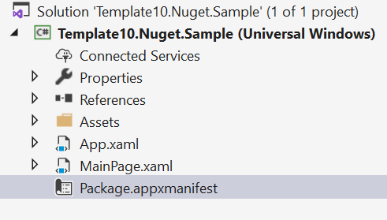
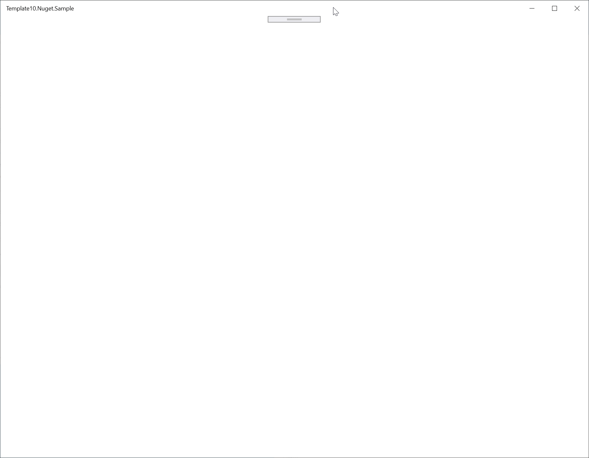

# Getting Started with Template10 on NuGet

In this hands-on lab you will create a simple application that will show you how to get started developing a UWP application using the Template10 NuGet packages.

## Prerequisities

* Visual Studio 2019
* Universal Windows Platform development workload installed
* Windows 10 SDK 10.0.16299.0 or higher

## Creating a Project

1. Open Visual Studio 2019 (**VS**) and in the launch dialog, under **Get STarted**, click **Create a new project**.
2. In the search box, enter **UWP** and then select **Blank App (Universal Windows), then click **Next**.
3. Under **Project name**, enter **Template10.Nuget.Sample**.
4. Under **Location**, enter the location you wish to create the solution.
5. Under **Solution name**, leave the default value.
6. Uncheck **Place solution and project in the same directory**.
7. To create the solution and project, click **Create**.
	
	You will be prompted with "Select the target and minimum platform versions that your UWP application will support."
	The Minimum version must be set to 16299 or higher. The Target version can be set to anything you like.

	> Your minimum version must be UAP 10.0.16299 or higher.

    After a few moments, the new solution will open. This is a minimal application that will display a blank window.

    
8. To run the app, hit **F5**.

    
9.  Close the blank app before proceeding.

## Adding the Template10 Nuget Package

1. In **VS**, under the **Tools > NuGet Package Manager** menu, click **Package Manager Console**.
    The **Package Manager Console** window will open.
2. In the **Package Manager Console** window, to install Template10, enter **Install-Package Template10 -Version 2.0.0**
3. Open the file **App.xaml**:

    ```xml
    <Application
        x:Class="Template10.Nuget.Sample.App"
        xmlns="http://schemas.microsoft.com/winfx/2006/xaml/presentation"
        xmlns:x="http://schemas.microsoft.com/winfx/2006/xaml"
        xmlns:local="using:Template10.Nuget.Sample">

    </Application>
    ```

4. Update the **App.xaml** file as follows:

    ```xml
    <T10:ApplicationBase
        xmlns:T10="using:Template10"
        x:Class="Template10.Nuget.Sample.App"
        xmlns="http://schemas.microsoft.com/winfx/2006/xaml/presentation"
        xmlns:x="http://schemas.microsoft.com/winfx/2006/xaml"
        xmlns:local="using:Template10.Nuget.Sample">

    </T10:ApplicationBase>
    ```

    The changes have added a new namespace `xmlns:T10="using:Template10"` and changed the base class of the application to `T10:ApplicationBase` - we now need to make changes to the **App.xaml.cs** code-behind file.
5. Open **App.xaml.cs** by either hitting **F7** or selecting it within the **Solution Explorer** window (it is nested beneath **App.xaml**).
    In a regular UWP application, there is quite a lot of code by default in the **App.xaml.cs** file - Template10 makes much of this code redundant.
6. Replace the content of **App.xaml.cs** with the following:

    ```csharp
    using Prism.Ioc;
    using System;
    using System.Threading.Tasks;
    using Template10.Ioc;
    using Template10.Navigation;
    using Template10.Services;
    using Windows.UI.Xaml;
    using Windows.UI.Xaml.Controls;

    namespace Template10.Nuget.Sample
    {
        sealed partial class App : ApplicationBase
        {
            private INavigationService _nav;

            public App() => InitializeComponent();

            public override void RegisterTypes(IContainerRegistry container)
            {
                container.RegisterView<MainPage, MainPageViewModel>();
            }

            public override void OnInitialized()
            {
                var frame = new Frame();
                Window.Current.Content = new ShellPage { Frame = frame };
                Window.Current.Activate();
                _nav = NavigationFactory
                    .Create(frame, Guid.Empty.ToString())
                    .AttachGestures(Window.Current, Gesture.Back, Gesture.Forward, Gesture.Refresh);
            }

            public override async Task OnStartAsync(IStartArgs args)
            {
                if (args.StartKind == StartKinds.Launch)
                {
                    await _nav.NavigateAsync(nameof(MainPage));
                }
            }
        }
    }
    ```

    You will see errors relating to **MainPageViewModel** and **ShellPage** - we will fix those shortly.

7. Create two folders in the project:

    * ViewModels - by convention, we will create all view models in this folder.
    * Views - by convention, we will create all views within this folder

8. Delete the existing **MainPage.xaml** file - we will create a new one in the correct location shortly.

9. Within the **Views** folder, **Add new item**, choose **Blank Page** and name it **ShellPage.xaml**.

10. Open the **ShellPage.xaml** file and in the XAML editor, update the empty `<Grid></Grid>` elements as follows:

    ```xml
    <Grid>
        <NavigationView x:Name="MainNavigationView" x:FieldModifier="public" ItemInvoked="MainNavigationView_ItemInvoked">
            <NavigationView.MenuItems>
                <NavigationViewItem Icon="Home" Content="Home" x:Name="HomeNavigationViewItem" />
            </NavigationView.MenuItems>
        </NavigationView>
    </Grid>
    ```

    Here we add a simple **NavigationVIew** controls with a single item.

11. Switch to the **ShellPage.xaml.cs** code-behind file - **F7** is the default keyboard shortcut to do this.

12. Replace the definition of the **ShellPage** class as follows:

    ```csharp
    public sealed partial class ShellPage : Page
    {
        public event EventHandler<Exception> NavigationFailed;

        public ShellPage()
        {
            InitializeComponent();
        }

        public new Frame Frame
        {
            get => MainNavigationView.Content as Frame;
            set => MainNavigationView.Content = value;
        }

        private async void MainNavigationView_ItemInvoked(NavigationView sender, NavigationViewItemInvokedEventArgs args)
        {
            if (args.IsSettingsInvoked)
            {
                // TODO:
            }
            else
            {
                switch (args.InvokedItemContainer)
                {
                    case NavigationViewItem item when Equals(item, HomeNavigationViewItem):
                        {
                            await NavigateAsync(nameof(MainPage));
                            break;
                        }
                    default:
                        {
                            break;
                        }
                }
            }
        }

        private async Task NavigateAsync(string key)
        {
            var navigation = Frame.GetNavigationService();
            var result = await navigation.NavigateAsync(key);
            if (result.Success)
            {
                return;
            }
            NavigationFailed?.Invoke(Frame, result.Exception);
        }
    }
    ```

    This code initializes the navigation for the project. You will note the error for the missing **MainPage** - we will address that shortly.

13. Add the missing using statements, either via the actions or by just pasting the following at the top of the file"

    ```csharp
    using System.Threading.Tasks;
    using Template10.Navigation;
    ```

14. To begin to create the **MainPageViewModel**, create a folder within **Views** and call it **MainPageViewModel**.

15. Within the **MainPageViewModel** folder, create the following three files:

     * **Design.MainPageViewModel.cs** - a design-time version of the view model so we can display data in the designer.
     * **IMainPageViewModel.cs** - an interface that defines our view model properties.
     * **MainPageViewModel.cs** - the runtime version of our view model.

16. Open **IMainPageViewModel.cs** and replace the content with the following:

    ```csharp
    namespace Template10.Nuget.Sample.ViewModels
    {
        public interface IMainPageViewModel
        {
            string Title { get; set; }
        }
    }
    ```

    A view model doesn't get any simpler than that defined by this interface!

17. Open **Design.MainPageViewModel.cs** and replace the content with the following:

    ```csharp
    using Prism.Mvvm;

    namespace Template10.Nuget.Sample.ViewModels.Design
    {
        public class MainPageViewModel : BindableBase, IMainPageViewModel
        {
            public MainPageViewModel()
            {
                Title = "Hello design-time world.";
            }

            private string _title;
            public string Title
            {
                get => _title;
                set => SetProperty(ref _title, value);
            }
        }
    }
    ```

    Our design time view model implements **IMainPageViewModel** and inherits from **Prism.Mvvm.BindableBase**. Amongst other things, **BindableBase** gives us **SetProperty** which ensures the view model raises property changed events.

    > **Note:** Confused about binding? Learn more [here](https://docs.microsoft.com/en-us/windows/uwp/data-binding/).

18. Open **MainPageViewModel.cs** and replace the content with the following:

    ```csharp
    using Template10.Mvvm;
    using Template10.Navigation;

    namespace Template10.Nuget.Sample.ViewModels
    {
        public class MainPageViewModel : ViewModelBase, IMainPageViewModel
        {
            public override void OnNavigatedTo(INavigationParameters parameters)
            {
                Title = "Hello run-time world.";
            }

            public override void OnNavigatedFrom(INavigationParameters parameters)
            {
                // empty
            }

            private string _title;
            public string Title
            {
                get => _title;
                set => SetProperty(ref _title, value);
            }
        }
    }
    ```

    The runtime view model also implements **IMainPageViewModel**, but this time inherits from **ViewModelBase**. **ViewModelBase** extends **BindableBase** and provides access to the Template10 navigation capabilities. For example, above you can see that when the application navigates to this view model, the **Title** is set.

    Now we need to create the view.

19. Within the **Views** folder, **Add new item**, choose **Blank Page** and name it **MainPage.xaml**.

20. Open the **MainPage.xaml** file and in the XAML editor and replace the content as follows:

    ```xml
    <Page
        x:Class="Template10.Nuget.Sample.Views.MainPage"
        xmlns="http://schemas.microsoft.com/winfx/2006/xaml/presentation"
        xmlns:x="http://schemas.microsoft.com/winfx/2006/xaml"
        xmlns:d="http://schemas.microsoft.com/expression/blend/2008"
        xmlns:mc="http://schemas.openxmlformats.org/markup-compatibility/2006"
        xmlns:designtime="using:Template10.Nuget.Sample.ViewModels.Design"
        mc:Ignorable="d"
        Background="{ThemeResource ApplicationPageBackgroundThemeBrush}">

        <d:Page.DataContext>
            <designtime:MainPageViewModel />
        </d:Page.DataContext>

        <Grid>
            <TextBlock Text="{Binding Title}" Style="{StaticResource HeaderTextBlockStyle}" Margin="16" />
        </Grid>

    </Page>
    ```

    A couple things of note here - the first is we are going to use a design-time view model and so we add in a namespace for it `xmlns:designtime="using:Template10.Nuget.Sample.ViewModels.Design"` and set the data context in XAML. The second item is the very simple example of data binding that just shows a title.

21. To customize the code-behind, hit **F7** and add the following code below the constructor.

    ```csharp
    public MainPageViewModel ViewModel => DataContext as MainPageViewModel;
    ```

    This property provides strongly-typed access to the **DataContext**.

    Now we need to ensure that **App.xaml.cs** has a reference to our Views and ViewModels.

22. Open **App.xaml.cs** and add the following usings to the top of the file:

    ```csharp
    using Template10.Nuget.Sample.ViewModels;
    using Template10.Nuget.Sample.Views;
    ```

23. Now build and run the solution by hitting **F5**.